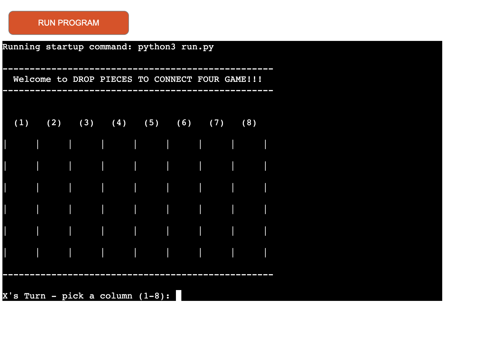
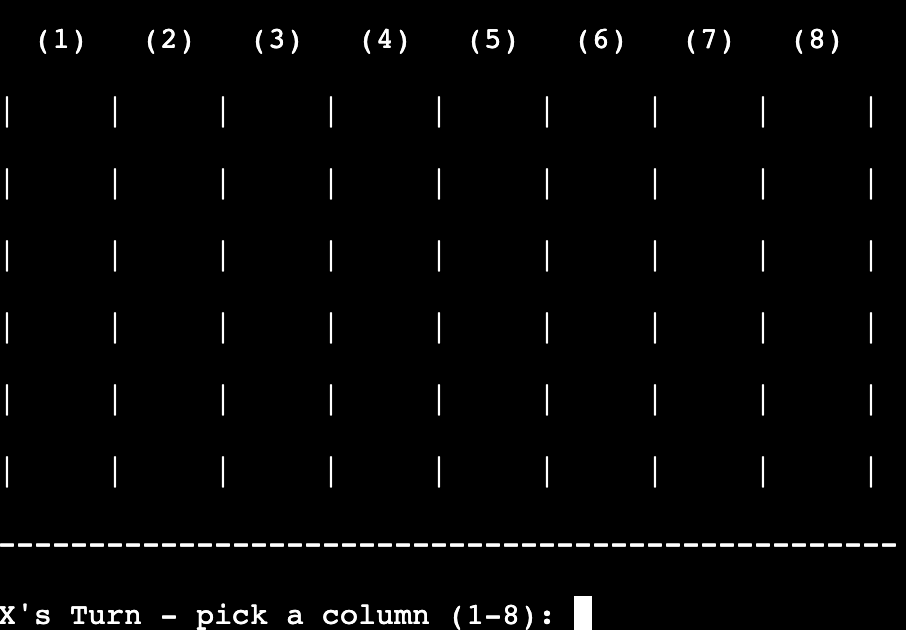
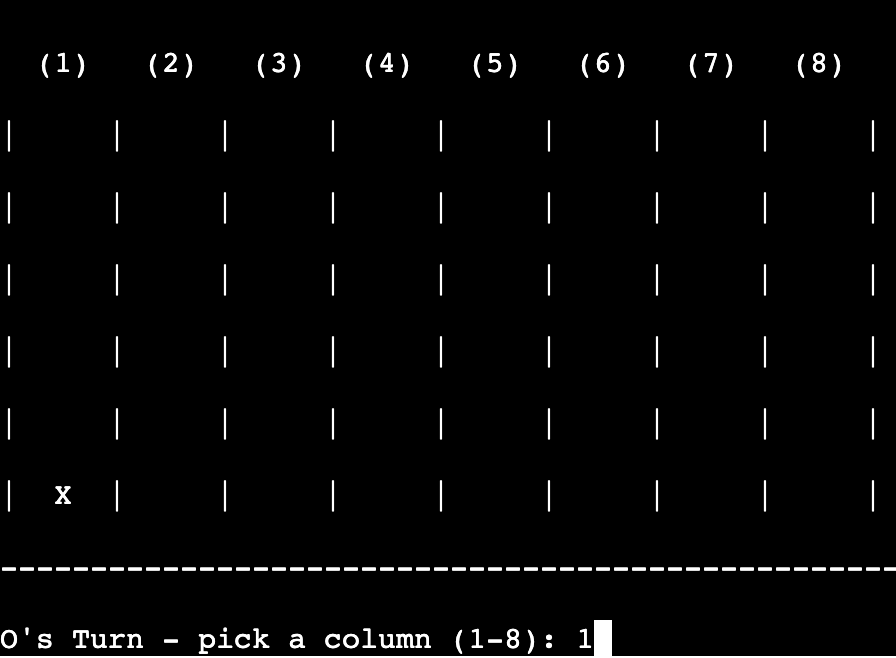
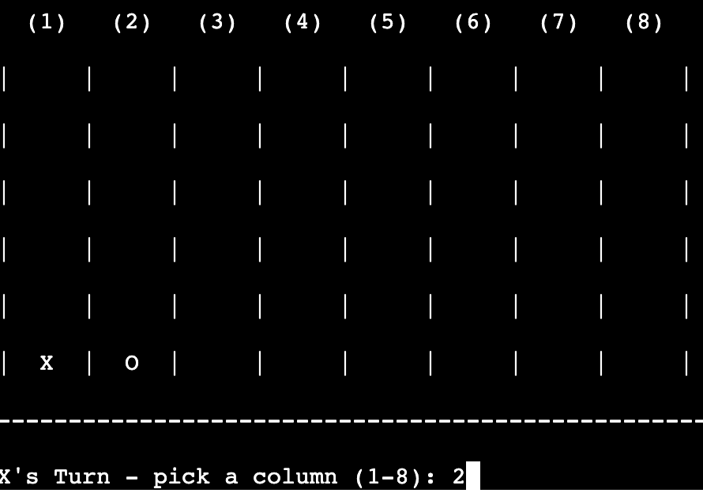
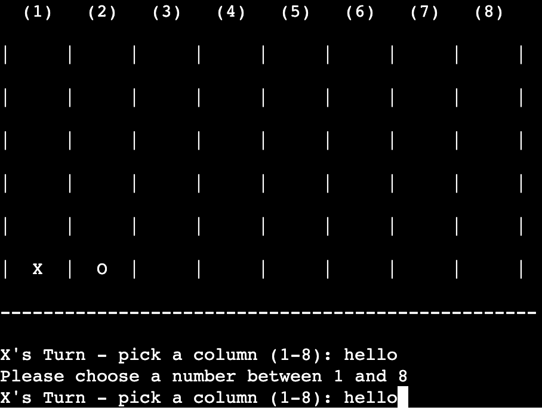
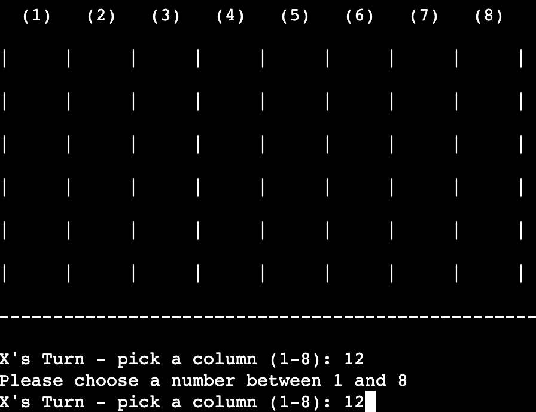
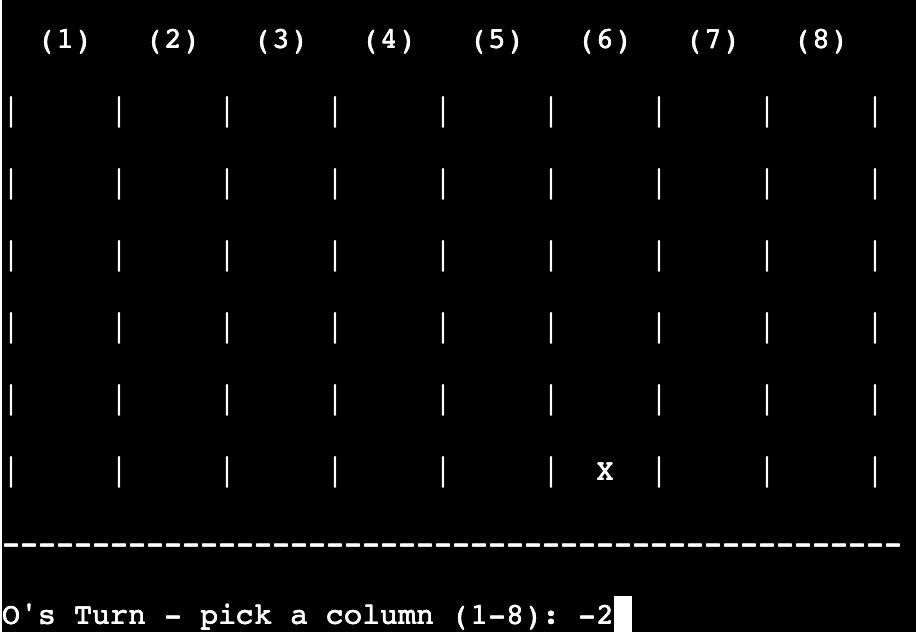

# CONNECT FOUR GAME
Connect four game  is a Python terminal game. which runs in the Code Institute mock terminal on Heroku. 2 Users (X or O) can try to beat each other by dropping and connecting four pieces whether vertically or horizontally or diagonally. The first player to connect four will win.

Here Is the live version of my project

## How to play
Connect four is based on the classic connect four game. You can read more about it on [Wikipedia](https://en.wikipedia.org/wiki/Connect_Four) 
in this version, the players names are automaically generated (X,O).
Pieces dropped are marked on the board with an X or O marks.
The two players take it in turns to drop pieces and try to connect four.
The winner is the player who connects four four first whether vertically or horizontally or diagonally.

## Features
### Existing Features
- Random 6 row X 8 column board generation
- Marked up board with columns number on the top

- Play against another player
- Accept users input

- Input validation and error-checking
1. You cannot enter strings or texts

2. You must enter numbers from 0 to 8 only

3. Zero and minus values between 0 to 8 are acceptable, -8 value is not acceptable 0 = 8, -0 = 8 -1 = 7, -2 = 6, -3 = 5 and so on

- data maintained in class instances

### Future Features
- Allow more players to play the game the board size and number of shios
- bigger size board with more players 

## Data Model 
I decided to use a Board class as my model. The game creates the instance of the Board class. 
The Board class prints the slots of the board, rotate the turn of the player, check the position of the dropped piece. check the possibility of win against that board in all directions.
I used a python trick to print 64 dashes all next to each other using `print` method.

## Testing
[ have manually tested this proiect by doing the following:
- passed the code through a PE8 linter and confirmed there are no problems
- Given invalid inouts: strings when numbers are expected out of bounds inputs.
- Tested in my local terminal and the Code Institute Heroku terminal

## Bugs 
When I wrote the proiect. I was aetting index errors because I had forgotten that the lists are zero indexed. I fixed
this br addina size _ 1 where necessarv
properly

## Remaining Bugs
• No bugs remaining

## Validator Testing
- PEP8
No errors were returned from PEP8.online.com

## Deployment
This proiect was deployed using Code Institute's mock terminal for Heroku.

Stens for deplovment
o Fork or clone this renocitor.
a Crosto a nom Horobu onn
o link the Herokuann to the renociton
click on Donlou

Credits
- Code Institute for the deployment terminal
- Wikipedia for the details of the connect four game
- My mentor Lauren Nicole
- freeCodeCamp.org
- stackoverflow.com
- quora.com
